# Diagramas Mermaid - Proyecto Panda 2025

## 0. Contexto: Monorepo e infraestructura

El proyecto se integra en un **monorepo en GitHub**. Toda la infraestructura AWS está desarrollada y lista. El repositorio tiene todo automatizado: CI/CD, despliegues, aprobaciones y controles de seguridad.

### Plataforma y automatización


| Aspecto              | Detalle                                                                          |
| -------------------- | -------------------------------------------------------------------------------- |
| **Repositorio**      | GitHub (monorepo)                                                                |
| **Infraestructura**  | AWS, ya desarrollada                                                             |
| **Automatización**   | CI/CD, despliegues, aprobaciones, seguridad                                      |
| **Roles y usuarios** | Gestionados con AWS (Cognito / IAM)                                              |
| **Objetivo Admin**   | Interfaz en Admin para gestionar usuarios/roles **sin entrar al console de AWS** |


### Landing y Portal en paralelo

La **Landing page aún no está desarrollada**. Se desarrolla **en paralelo** con el Portal Panda. Ambos se integran al monorepo y comparten el mismo contexto de autenticación.

### Estructura del monorepo

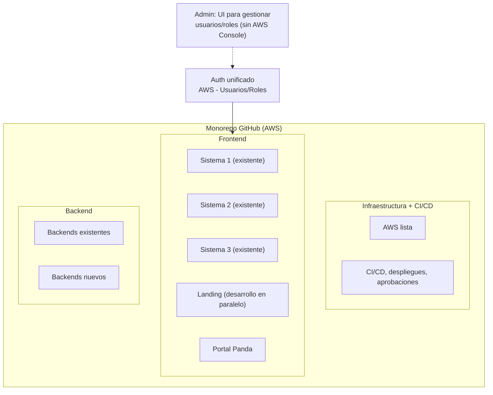


### Autenticación unificada

Los **5 frontends** (3 sistemas existentes + Landing + Portal) comparten **un único contexto de login**:

- Un solo login para acceder a todos los sistemas
- Roles y usuarios gestionados con AWS
- **Ideal**: Interfaz en Admin para asignar roles/usuarios sin usar la consola de AWS
- El usuario autenticado navega entre sistemas sin volver a loguearse

### Diagrama de integración Frontend

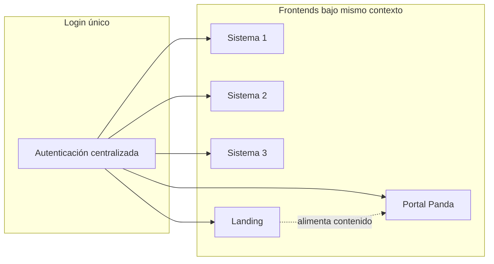


### Notas de integración


| Componente           | Estado                                        | Ubicación en monorepo         |
| -------------------- | --------------------------------------------- | ----------------------------- |
| **Infraestructura**  | Lista (AWS), CI/CD automatizado               | Raíz / infra                  |
| **Sistemas 1, 2, 3** | Desarrollados, independientes                 | `frontend/`                   |
| **Landing**          | **En desarrollo (paralelo al Portal)**        | `frontend/landing`            |
| **Portal Panda**     | Este proyecto                                 | `frontend/portal` (o similar) |
| **Auth**             | AWS (Cognito/DynamoDB). Objetivo: UI en Admin | Compartido                    |
| **Backends**         | Existentes + nuevos                           | `rest/`                       |


---

## 1. Arquitectura general del proyecto (Portal Panda)

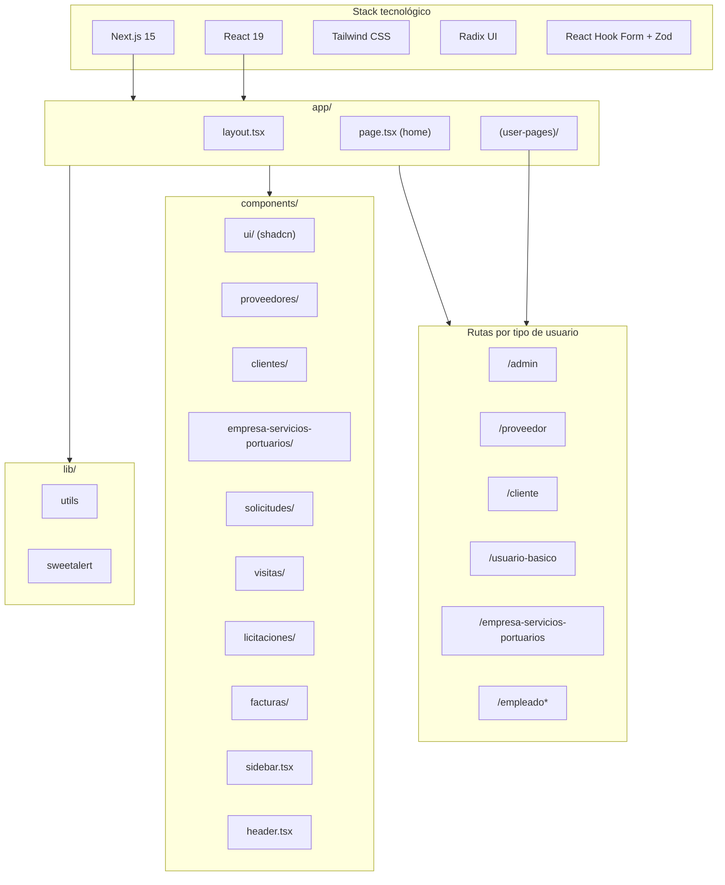


## 2. Portales y roles de usuario

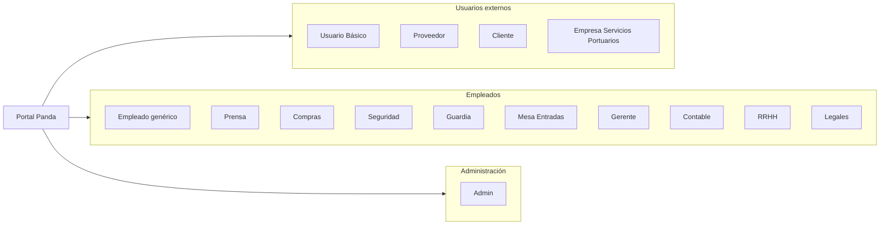


## 3. Módulos por portal (vista simplificada)

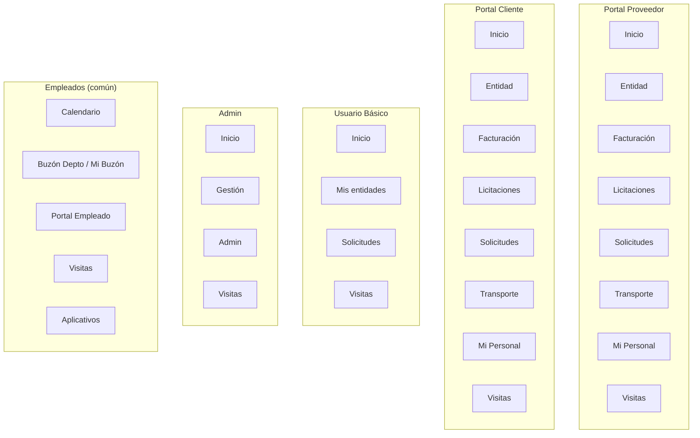


## 4. Flujo de datos y capas

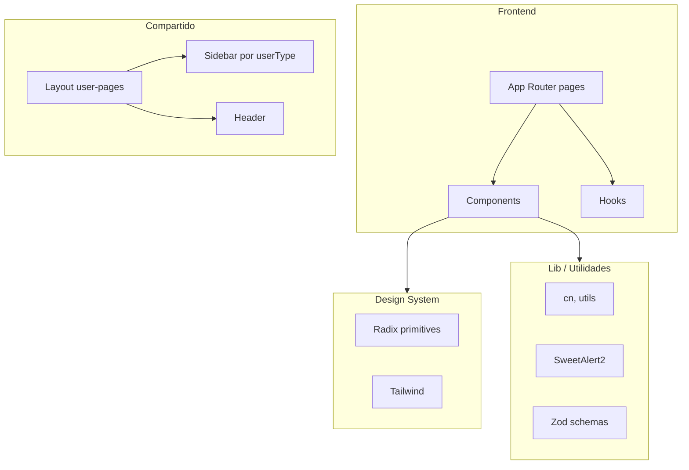


## 5. Estructura de carpetas principal

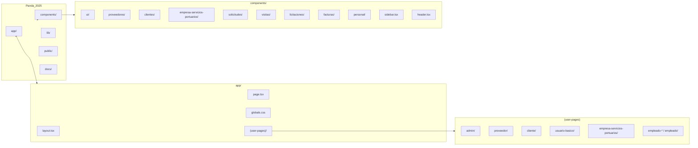


## 6. Entidades de negocio (dominio)

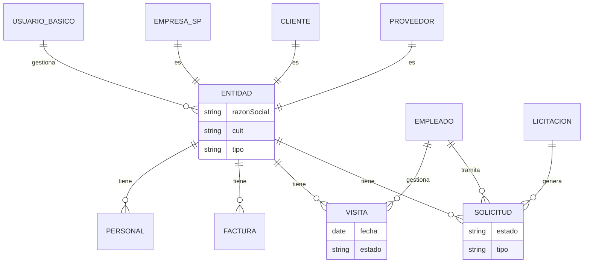


## 7. Navegación Sidebar → Rutas

```mermaid
flowchart TD
    S[Sidebar] -->|userType| M{userModules}
    M -->|Proveedor| P[/proveedor/...]
    M -->|Cliente| C[/cliente/...]
    M -->|Usuario Básico| U[/usuario-basico/...]
    M -->|Empresa SP| E[/empresa-servicios-portuarios/...]
    M -->|Admin| A[/admin/...]
    M -->|Empleado-*| EMP[/empleado-compras|prensa|seguridad|.../]

    P --> P1[gestion/entidad]
    P --> P2[gestion/facturacion]
    P --> P3[gestion/solicitudes]
    P --> P4[visitas/mis-visitas]

    U --> U1[gestion/mis-entidades]
    U --> U2[gestion/solicitudes]
    U --> U3[visitas/mis-visitas]
```


---

## 8. Módulos por portal desmenuzado

### 8.1 Proveedor


| Módulo           | Submódulos / Pantallas                                              |
| ---------------- | ------------------------------------------------------------------- |
| **Inicio**       | Dashboard con resumen                                               |
| **Entidad**      | Ver/editar datos de la entidad (Proveedor)                          |
| **Facturación**  | • Mi cuenta corriente • Órdenes de compra • Facturas • Percepciones |
| **Licitaciones** | Nueva inscripción                                                   |
| **Solicitudes**  | Mis solicitudes (listado, nueva, detalle)                           |
| **Transporte**   | • Mis transportes • Mis conductores                                 |
| **Mi Personal**  | Listado, alta, editar, eliminar personal                            |
| **Visitas**      | Mis visitas (listado, nueva, detalle)                               |
| **Perfil**       | Datos personales, Seguridad                                         |


### 8.2 Cliente


| Módulo           | Submódulos / Pantallas                             |
| ---------------- | -------------------------------------------------- |
| **Inicio**       | Dashboard con resumen                              |
| **Entidad**      | Ver/editar datos de la entidad (Cliente)           |
| **Facturación**  | • Mi cuenta corriente • Mis Facturas • Retenciones |
| **Licitaciones** | Listado y gestión de licitaciones                  |
| **Solicitudes**  | Mis solicitudes                                    |
| **Transporte**   | Mis transportes                                    |
| **Mi Personal**  | Listado, alta, editar, eliminar personal           |
| **Visitas**      | Mis visitas, nueva visita                          |
| **Perfil**       | Datos personales, Seguridad                        |


### 8.3 Usuario Básico


| Módulo            | Submódulos / Pantallas                                                                                                                                                                                                                                     |
| ----------------- | ---------------------------------------------------------------------------------------------------------------------------------------------------------------------------------------------------------------------------------------------------------- |
| **Inicio**        | Dashboard, cards (Mis Entidades, Mis Visitas, Mi Perfil), Actividad reciente, Próximas visitas                                                                                                                                                             |
| **Mis entidades** | • Listado de entidades • Nueva entidad (modal: Proveedor / Cliente / Empresa SP) • Alta proveedor (Datos generales, Direcciones, Info comercial) • Alta cliente (idem) • Alta empresa servicios portuarios • Ver detalle (form readonly) • Modificar datos |
| **Solicitudes**   | Mis solicitudes                                                                                                                                                                                                                                            |
| **Visitas**       | Mis visitas, nueva visita                                                                                                                                                                                                                                  |
| **Perfil**        | Datos personales                                                                                                                                                                                                                                           |


### 8.4 Empresa Servicios Portuarios


| Módulo           | Submódulos / Pantallas               |
| ---------------- | ------------------------------------ |
| **Inicio**       | Dashboard                            |
| **Entidad**      | Ver/editar datos de la entidad       |
| **Facturación**  | • Mi cuenta corriente • Mis Facturas |
| **Licitaciones** | Listado y gestión                    |
| **Solicitudes**  | Mis solicitudes, nueva solicitud     |
| **Transporte**   | Mis vehículos                        |
| **Mi Personal**  | Listado, alta, editar, eliminar      |
| **Visitas**      | Mis visitas                          |
| **Perfil**       | Datos personales                     |


### 8.5 Empleado - Compras


| Módulo                 | Submódulos / Pantallas                                                     |
| ---------------------- | -------------------------------------------------------------------------- |
| **Inicio**             | Dashboard                                                                  |
| **Calendario**         | Calendario de eventos                                                      |
| **Buzón Departamento** | Solicitudes del departamento                                               |
| **Mi Buzón**           | Mis solicitudes, solicitudes empleados [id], solicitudes externas [id]     |
| **Portal Empleado**    | Mis solicitudes, nueva solicitud                                           |
| **Licitaciones**       | • Listado • Nueva licitación • Editar [id] • Detalle [id] • Estados        |
| **Proveedores**        | • Listado • Nuevo • Detalle [id] • Cuenta corriente [id] • Pendientes [id] |
| **Reportes**           | Reportes, órdenes compra, facturas proveedores                             |
| **Visitas**            | Mis visitas                                                                |
| **Aplicativos**        | Listado de aplicativos                                                     |


### 8.6 Empleado - Prensa


| Módulo                  | Submódulos / Pantallas            |
| ----------------------- | --------------------------------- |
| **Calendario**          | Calendario de eventos             |
| **Buzón / Mi Buzón**    | Solicitudes                       |
| **Portal Empleado**     | Mis solicitudes                   |
| **Blog**                | Mis post, nuevo post, editar [id] |
| **Documentación**       | Gestión de documentación          |
| **Galería de imágenes** | Gestión de imágenes               |
| **Visitas**             | Mis visitas                       |
| **Eventos**             | Listado, detalle [id]             |


### 8.7 Empleado - Seguridad


| Módulo                | Submódulos / Pantallas |
| --------------------- | ---------------------- |
| **Calendario**        | Calendario             |
| **Buzón / Mi Buzón**  | Solicitudes            |
| **Portal Empleado**   | Mis solicitudes        |
| **Transporte Cargas** | Camiones pendientes    |
| **Visitas**           | Visitas pendientes     |


### 8.8 Empleado - Mesa de Entradas


| Módulo               | Submódulos / Pantallas    |
| -------------------- | ------------------------- |
| **Calendario**       | Calendario                |
| **Buzón / Mi Buzón** | Solicitudes               |
| **Facturas**         | Gestión de facturas       |
| **Expedientes**      | Gestión de expedientes    |
| **Licitaciones**     | Gestión de licitaciones   |
| **Visitas**          | Mis visitas, nueva visita |


### 8.9 Empleado - Contable


| Módulo               | Submódulos / Pantallas               |
| -------------------- | ------------------------------------ |
| **Calendario**       | Calendario                           |
| **Buzón / Mi Buzón** | Solicitudes                          |
| **Proveedores**      | Listado, pendientes, pendientes [id] |
| **Clientes**         | Listado                              |
| **Visitas**          | Mis visitas                          |


### 8.10 Empleado - RRHH


| Módulo               | Submódulos / Pantallas                                                                                     |
| -------------------- | ---------------------------------------------------------------------------------------------------------- |
| **Calendario**       | Calendario                                                                                                 |
| **Buzón / Mi Buzón** | Solicitudes                                                                                                |
| **Empleados**        | • Listado • Alta • Editar [id] • Perfil [id] • Licencias • Licencias activas • Cumpleaños • Actividad [id] |
| **Organigrama**      | • Gerencias • Departamentos • Cargos • Jerarquías                                                          |
| **Visitas**          | Mis visitas                                                                                                |


### 8.11 Empleado - Legales


| Módulo                           | Submódulos / Pantallas |
| -------------------------------- | ---------------------- |
| **Calendario**                   | Calendario             |
| **Buzón / Mi Buzón**             | Solicitudes            |
| **Empresa Servicios Portuarios** | • Listado • Pendientes |
| **Reportes**                     | Contratos              |
| **Visitas**                      | Mis visitas            |


### 8.12 Admin


| Módulo                                         | Submódulos / Pantallas                                                                                                                                                                                                                                                                                                                                           |
| ---------------------------------------------- | ---------------------------------------------------------------------------------------------------------------------------------------------------------------------------------------------------------------------------------------------------------------------------------------------------------------------------------------------------------------- |
| **Gestión**                                    | • Calendario vista • Buzón Departamento • Mi Buzón • Portal Empleado                                                                                                                                                                                                                                                                                             |
| **Admin**                                      | • Logs • Usuarios listado • Estáticos • Flujos de aprobación (listado, nuevo, editar [id])                                                                                                                                                                                                                                                                       |
| **Admin (no visible en sidebar pero existen)** | • Proveedores: listado, nuevo, pendientes, detalle [id], cuenta corriente [id], facturas [id] • Clientes: listado, nuevo, pendientes, detalle [id], cuenta corriente [id], facturas [id] • Empleados: listado, alta, editar [id], perfil [id], licencias, cumpleaños, actividad [id] • Organigrama: gerencias, departamentos, cargos, jerarquías • Documentación |
| **Visitas**                                    | Mis visitas, nueva visita, detalle [id]                                                                                                                                                                                                                                                                                                                          |


---

## 9. Orden de prioridad de desarrollo (etapas)

### Responsable por rol (quién desarrolla qué)

Los módulos del MVP se asocian a roles específicos que deben desarrollarse en las primeras etapas:


| Rol                   | Módulos que maneja                                                      | Prioridad             |
| --------------------- | ----------------------------------------------------------------------- | --------------------- |
| **Empleado Prensa**   | Blog, Material descargable, Galería de imágenes, Documentación, Eventos | 2, 5, 6 (alta en MVP) |
| **Empleado Compras**  | Licitaciones (listado, nueva, editar, estados, inscripciones)           | 4                     |
| **Empleado Contable** | Tarifario (gestión de tarifas, categorías, precios)                     | 3                     |
| **Admin**             | Usuarios, roles, estáticos, flujos                                      | 1 (parcial), 11       |


### Diagrama rol → módulos (MVP Landing)

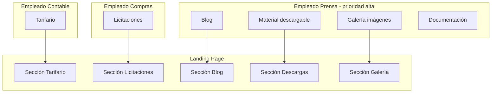


### Diagrama de prioridad de módulos (orden de desarrollo)

```mermaid
flowchart LR
    P1["1. Fundación"]
    P2["2. Prensa: Blog"]
    P3["3. Contable: Tarifario"]
    P4["4. Compras: Licitaciones"]
    P5["5. Prensa: Material"]
    P6["6. Prensa: Galería"]
    P7["7. Core portales"]
    P8["8. Visitas"]
    P9["9. Solicitudes"]
    P10["10. Facturación"]
    P11["11. Admin"]
    P12["12. Extras"]

    P1 --> P2 --> P3 --> P4 --> P5 --> P6 --> P7 --> P8 --> P9 --> P10 --> P11 --> P12
```


### Diagrama de etapas (bloques) con roles

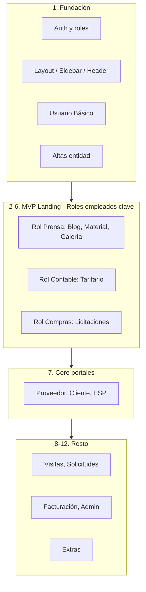


### Tabla de prioridad de módulos (con rol responsable)


| #      | Etapa                | Módulo                                                       | Rol responsable    | Justificación                                                           |
| ------ | -------------------- | ------------------------------------------------------------ | ------------------ | ----------------------------------------------------------------------- |
| **1**  | Fundación            | Auth, Layout, Sidebar, Header, Usuario Básico, Altas entidad | Admin / Full stack | Base del portal.                                                        |
| **2**  | Blog                 | CRUD posts, listado público, detalle                         | **Prensa**         | Alimenta Blog de la landing. Desarrollar rol Prensa en primeras etapas. |
| **3**  | Tarifario            | Gestión tarifas, visualización pública                       | **Contable**       | Alimenta Tarifario de la landing. Rol Contable prioritario.             |
| **4**  | Licitaciones         | Listado público, inscripción, gestión                        | **Compras**        | Alimenta Licitaciones de la landing. Rol Compras prioritario.           |
| **5**  | Material descargable | Documentos, descargas, categorías                            | **Prensa**         | Alimenta sección descargas. Prensa gestiona contenido.                  |
| **6**  | Galería de imágenes  | Subir, categorizar, galería pública                          | **Prensa**         | Alimenta Galería de la landing. Prensa gestiona imágenes.               |
| **7**  | Core portales        | Entidad y Perfil (Proveedor, Cliente, ESP)                   | Full stack         | Lo que ve un usuario al entrar.                                         |
| **8**  | Visitas              | Listado, solicitar, gestionar                                | Varios             | Proceso operativo principal.                                            |
| **9**  | Solicitudes          | Solicitudes, Buzón, Flujos                                   | Varios             | Tramitación central.                                                    |
| **10** | Facturación          | Cuenta corriente, facturas, OC                               | Contable           | Rol Contable.                                                           |
| **11** | Admin e internos     | Usuarios, proveedores, RRHH, Compras                         | Admin              | Gestión interna.                                                        |
| **12** | Extras               | Transporte, reportes, aplicativos                            | Varios             | Complementarios.                                                        |


---

## 10. Estimación de tiempos y responsabilidades

Dos escenarios de equipo. Landing y Portal se desarrollan **en paralelo**.

**Alcance MVP:** Landing completa + Portal (Prensa, Compras, Contable).  
**Alcance completo:** Todo el portal + Admin con UI para usuarios/roles (sin AWS Console).

---

### Opción A: 2 Frontend Senior + 1 Backend Senior

#### MVP (Opción A)


| Rol                | Responsabilidades                             | Estimación  |
| ------------------ | --------------------------------------------- | ----------- |
| **Backend Senior** | Auth, APIs, DB, file storage, AWS             | 6-8 semanas |
| **Frontend 1**     | Landing completa + consumo de APIs            | 5-6 semanas |
| **Frontend 2**     | Portal: fundación + Prensa, Compras, Contable | 7-9 semanas |


**MVP Opción A: 10-12 semanas (2,5-3 meses)** — *Paralelización: un front en landing, otro en portal.*

#### Proyecto completo (Opción A)


| Rol                | Responsabilidades                                                             | Estimación |
| ------------------ | ----------------------------------------------------------------------------- | ---------- |
| **Backend Senior** | Todas las APIs, flujos, Admin API usuarios/roles                              | 5-7 meses  |
| **Frontend 1**     | Landing + portales externos (Proveedor, Cliente, ESP, Usuario Básico)         | 5-6 meses  |
| **Frontend 2**     | Portales empleados + Admin (UI para gestionar usuarios/roles sin AWS Console) | 6-8 meses  |


**Completo Opción A: 6-8 meses**

---

### Opción B: 1 Frontend Senior + 1 Backend Senior

#### MVP (Opción B)


| Rol                 | Responsabilidades                                                     | Estimación    |
| ------------------- | --------------------------------------------------------------------- | ------------- |
| **Backend Senior**  | Auth, APIs, DB, file storage, AWS                                     | 6-8 semanas   |
| **Frontend Senior** | Landing + Portal (fundación + Prensa, Compras, Contable) en secuencia | 12-16 semanas |


**MVP Opción B: 14-18 semanas (3,5-4,5 meses)** — *Un solo frontend para todo; sin paralelismo.*

#### Proyecto completo (Opción B)


| Rol                 | Responsabilidades                                                             | Estimación  |
| ------------------- | ----------------------------------------------------------------------------- | ----------- |
| **Backend Senior**  | Todas las APIs, flujos, Admin API                                             | 5-7 meses   |
| **Frontend Senior** | Landing + todo el portal (externos + empleados + Admin con UI usuarios/roles) | 10-14 meses |


**Completo Opción B: 10-14 meses** — *Frontend secuencial; backend puede ir adelantado.*

---

### Resumen comparativo


| Hito                  | Opción A (2F + 1B) | Opción B (1F + 1B) |
| --------------------- | ------------------ | ------------------ |
| **MVP**               | 10-12 semanas      | 14-18 semanas      |
| **Proyecto completo** | 6-8 meses          | 10-14 meses        |
| **De MVP a Completo** | +4-5 meses         | +5-7 meses         |


---

## 11. Propuesta de MVP (Minimum Viable Product)

### Alcance del MVP sugerido (landing + contenido público)

El MVP demuestra la **landing page completa** alimentada por el portal: contenido gestionado por Prensa, Compras y Contable.


| Incluir en MVP                                             | No incluir en MVP (v2+)                           |
| ---------------------------------------------------------- | ------------------------------------------------- |
| **Landing page** completa (hero, secciones, contacto)      | Portales externos completos                       |
| **Auth básico** y roles (Prensa, Compras, Contable, Admin) | Usuario Básico, Proveedor, Cliente, ESP completos |
| **Rol Prensa**: Blog (CRUD), Material descargable, Galería | Solicitudes, Visitas, Facturación                 |
| **Rol Compras**: Licitaciones (listado, nueva, editar)     | Buzón, Flujos aprobación                          |
| **Rol Contable**: Tarifario (gestión, categorías)          | Cuenta corriente, facturas                        |
| **Admin**: Usuarios básico                                 | Proveedores, Clientes, organigrama                |
| Layout, Sidebar, Header del portal                         | Resto de roles empleado                           |


### Diagrama MVP

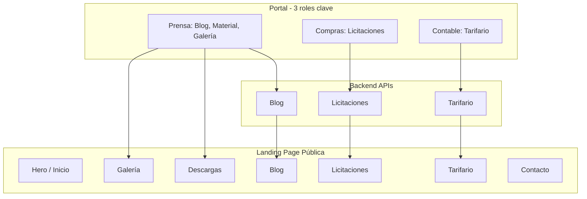


### Resumen MVP en una frase

> **MVP**: Landing page completa cuyas secciones (Blog, Tarifario, Licitaciones, Material descargable, Galería) se alimentan desde el portal, gestionadas por empleados Prensa, Compras y Contable. Sin portales externos (Proveedor/Cliente) ni flujos operativos (visitas, solicitudes, facturación).

### Criterios de éxito para la presentación del MVP

1. **Landing**: Diseño completo, responsive, todas las secciones visibles.
2. **Blog**: Publicar y editar posts desde Prensa; listado y detalle en la landing.
3. **Tarifario**: Gestionar tarifas desde Contable; visualización en la landing.
4. **Licitaciones**: Crear y gestionar desde Compras; listado público en la landing.
5. **Material descargable**: Subir documentos desde Prensa; sección descargas en la landing.
6. **Galería**: Subir imágenes desde Prensa; galería pública en la landing.
7. **Auth**: Login con roles (Prensa, Compras, Contable) y navegación por portal.

---

*Generado para el proyecto Panda 2025 - Portal Puerto La Plata.*