# Diagramas Mermaid - MVP Panda Monorepo 2026

## 0. Contexto: Monorepo e infraestructura

Este documento refleja el estado real del repositorio `mvp-panda` al día de hoy: dos apps Next.js (`landing` + `portal`) corriendo en paralelo desde un solo monorepo, con una sola URL visible para demo.

### Plataforma y automatización (estado real del repo)

| Aspecto                         | Detalle                                                 |
| ------------------------------- | ------------------------------------------------------- |
| **Repositorio**                 | Monorepo local `mvp-panda`                              |
| **Gestor de paquetes**          | `pnpm@10.12.2` (workspaces `apps/`*)                    |
| **Apps incluidas**              | `apps/landing` + `apps/portal`                          |
| **Comando único de desarrollo** | `pnpm dev` en raíz (levanta ambas apps en paralelo)     |
| **Puertos internos**            | Landing `3000`, Portal `3001`                           |
| **URL pública de demo**         | `http://localhost:3000`                                 |
| **Deploy productivo de MVP**    | Vercel                                                  |
| **URL publicada**               | `https://mvp-panda.vercel.app/`                         |
| **Exposición del portal**       | Subruta `/portal` mediante rewrites en landing          |
| **Scope funcional MVP**         | Landing completa + Portal recortado a Prensa y Contable |

### Landing y Portal en paralelo

La ejecución actual del MVP está centrada en:

- Landing accesible en raíz `/`.
- Portal accesible en `/portal` (proxy interno a `3001`).
- Experiencia de navegación unificada para demo, sin cambiar de dominio.

### Estructura del monorepo

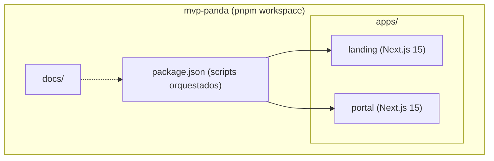

### Integración de rutas entre apps

En dev, `apps/landing` reescribe:

- `/portal` -> `http://localhost:3001`
- `/portal/:path*` -> `http://localhost:3001/:path*`

Controlado por:

- `PORTAL_ORIGIN` (default `http://localhost:3001`)
- `ENABLE_LOCAL_PORTAL_PROXY` (activo salvo que sea `"false"`)

En `apps/portal` se usa `assetPrefix: "/portal"` y helpers (`toPortalPath`, `normalizePortalPath`) para asegurar rutas y assets bajo namespace `/portal`.

### Diagrama de integración Frontend

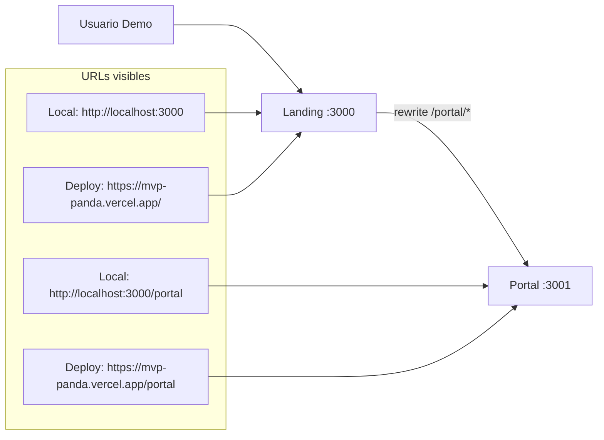

### Notas de integración

| Componente                  | Estado                                             | Ubicación                             |
| --------------------------- | -------------------------------------------------- | ------------------------------------- |
| **Monorepo root**           | Operativo con scripts únicos                       | `package.json`, `pnpm-workspace.yaml` |
| **Landing**                 | Completa para demo (con 3 secciones en desarrollo) | `apps/landing`                        |
| **Portal**                  | Recortado en runtime a 2 roles MVP                 | `apps/portal`                         |
| **Deploy**                  | Publicado en Vercel                                | `https://mvp-panda.vercel.app/`       |
| **Auth real backend**       | No integrado en este MVP (flujo demo/simulado)     | Landing + Portal                      |
| **Documentación operativa** | Disponible                                         | `docs/`                               |

---

## 1. Arquitectura general del proyecto (MVP actual)

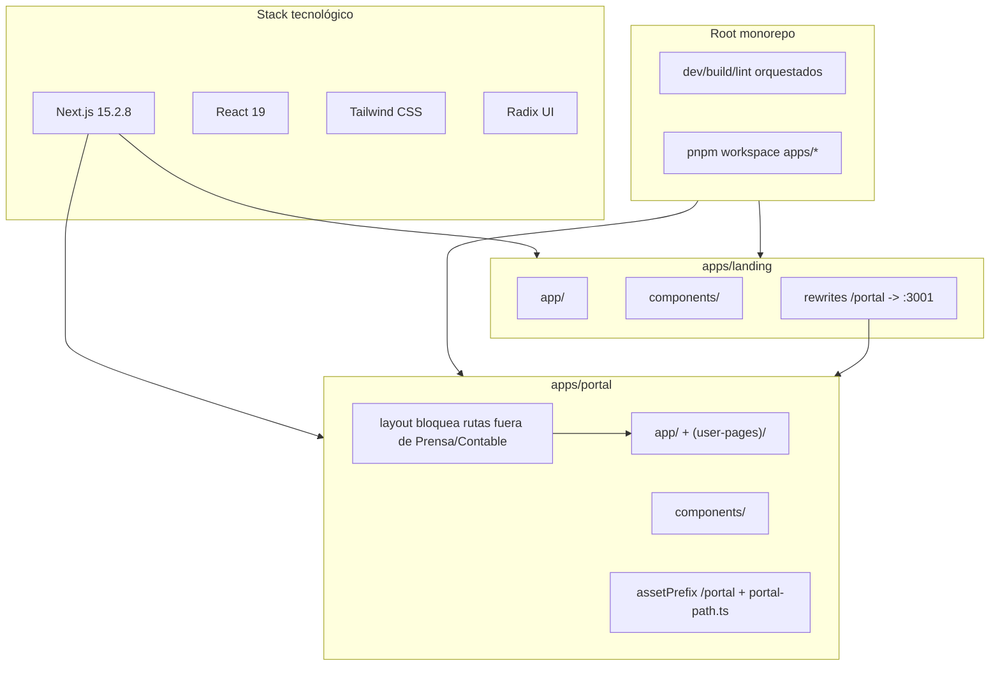

Puntos técnicos claves:

- El portal contiene muchas rutas históricas, pero el layout MVP permite navegación solo a:
  - `/empleado-prensa/*`
  - `/empleado-contable/*`
- Si se ingresa a otra ruta del portal, redirige automáticamente a `/portal/empleado-prensa`.

## 2. Portales y roles de usuario

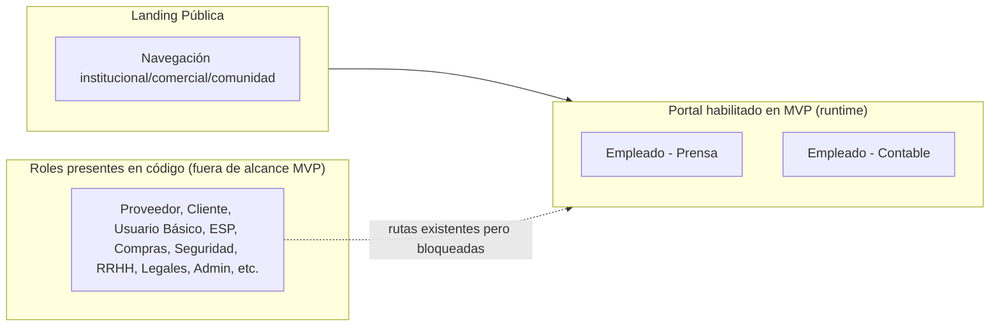

## 3. Módulos por portal (vista simplificada)

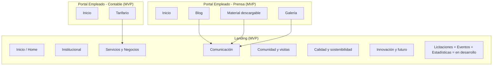

## 4. Flujo de datos y capas

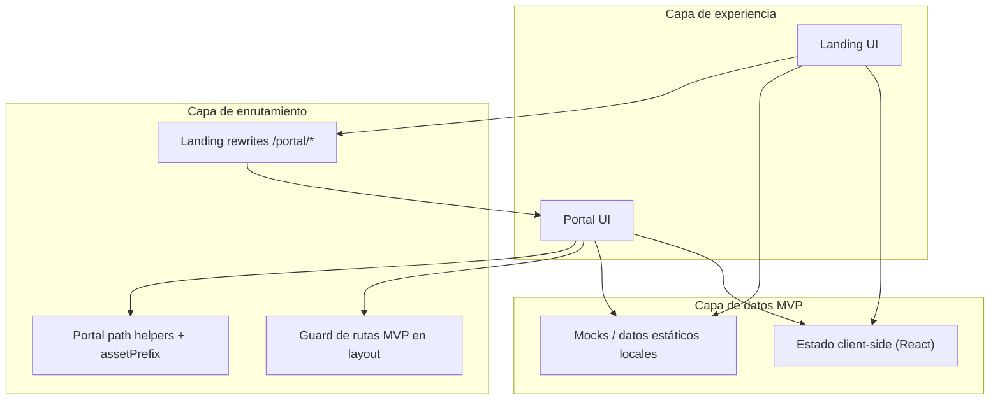

Observaciones:

- Este MVP no está acoplado a una API backend productiva en todos los módulos.
- Hay componentes/pantallas con datos simulados para demostración funcional.

## 5. Estructura de carpetas principal

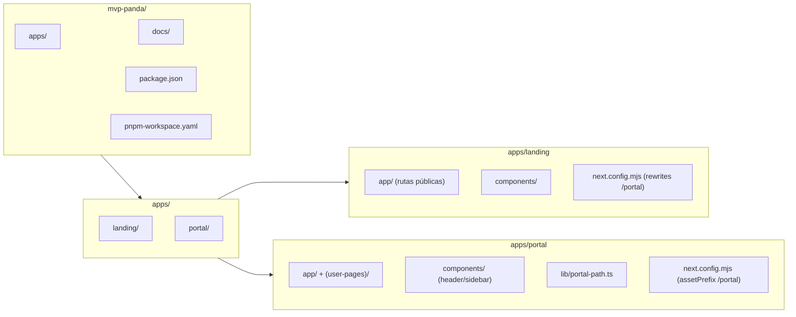

## 6. Entidades de negocio (dominio MVP)

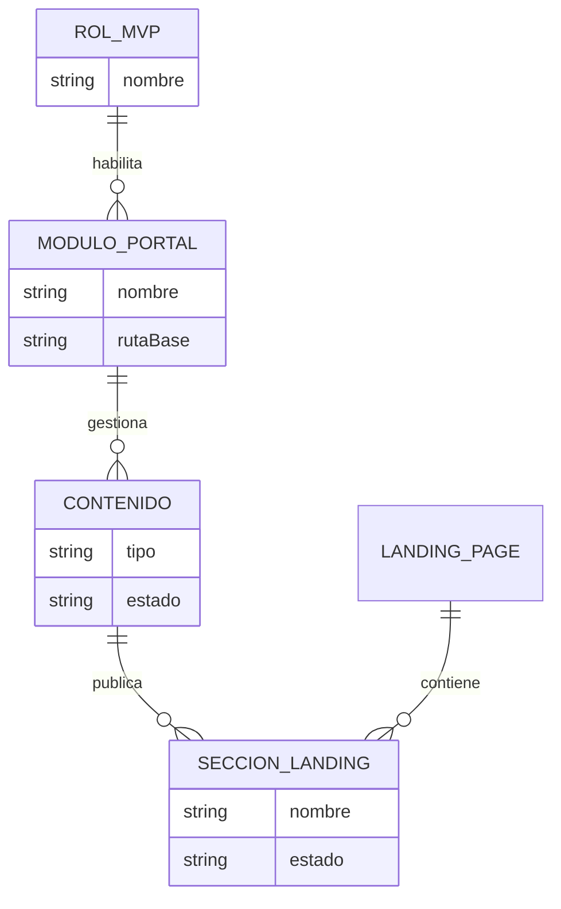

Modelo MVP real:

- Roles habilitados: **Empleado - Prensa**, **Empleado - Contable**.
- Contenido operativo para demo:
  - Prensa: blog, documentación/descargas, galería.
  - Contable: tarifario.
- Secciones explícitamente en desarrollo en landing:
  - Licitaciones (`/licitaciones`)
  - Eventos (`/comunidad/eventos`)
  - Estadísticas (`/estadisticas`)

## 7. Navegación Sidebar -> Rutas

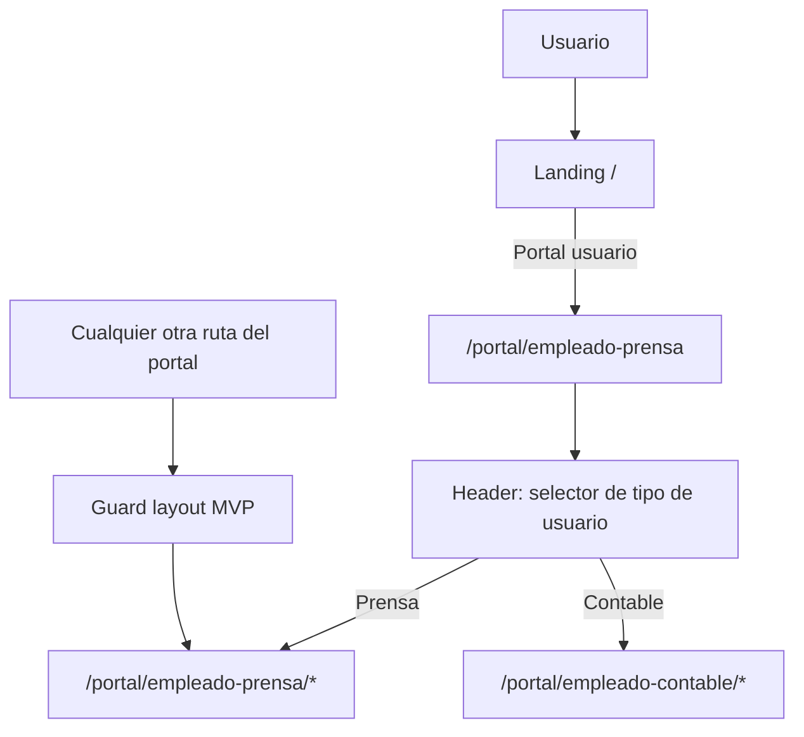

Notas:

- El `Sidebar` tiene definición amplia de roles, pero en runtime toma solo el set MVP (`mvpUserModules`).
- El `Header` del portal solo permite cambiar entre Prensa y Contable.

---

## 8. Módulos por portal desmenuzado

### 8.1 Proveedor

| Estado MVP           | Detalle                                                                                |
| -------------------- | -------------------------------------------------------------------------------------- |
| **Fuera de alcance** | Existen rutas/páginas en código, pero el guard de layout no permite navegación en MVP. |

### 8.2 Cliente

| Estado MVP           | Detalle                                                                 |
| -------------------- | ----------------------------------------------------------------------- |
| **Fuera de alcance** | Existen rutas/páginas en código, pero no habilitadas en navegación MVP. |

### 8.3 Usuario Básico

| Estado MVP           | Detalle                                                             |
| -------------------- | ------------------------------------------------------------------- |
| **Fuera de alcance** | Existen rutas/páginas en código, bloqueadas por guard de rutas MVP. |

### 8.4 Empresa Servicios Portuarios

| Estado MVP           | Detalle                                                      |
| -------------------- | ------------------------------------------------------------ |
| **Fuera de alcance** | Rutas presentes en código, no habilitadas en flujo demo MVP. |

### 8.5 Empleado - Compras

| Estado MVP                     | Detalle                                                                                         |
| ------------------------------ | ----------------------------------------------------------------------------------------------- |
| **Fuera de alcance funcional** | Módulos históricos existen en código, pero no se exponen en sidebar ni selector de usuario MVP. |

### 8.6 Empleado - Prensa

| Módulo MVP                        | Submódulos / Pantallas                                                                                                       |
| --------------------------------- | ---------------------------------------------------------------------------------------------------------------------------- |
| **Inicio**                        | Dashboard base de Prensa                                                                                                     |
| **Blog**                          | Mis post, nuevo post, editar, detalle                                                                                        |
| **Material descargable**          | Gestión documental para descargas                                                                                            |
| **Galería**                       | Gestión de imágenes                                                                                                          |
| **Rutas relacionadas existentes** | Calendario, buzones, solicitudes, visitas, perfil (presentes en código; no todas forman parte del alcance funcional de demo) |

### 8.7 Empleado - Seguridad

| Estado MVP           | Detalle                                                        |
| -------------------- | -------------------------------------------------------------- |
| **Fuera de alcance** | Existe implementación, no habilitada por navegación/guard MVP. |

### 8.8 Empleado - Mesa de Entradas

| Estado MVP           | Detalle                                              |
| -------------------- | ---------------------------------------------------- |
| **Fuera de alcance** | Módulos no habilitados en la experiencia MVP actual. |

### 8.9 Empleado - Contable

| Módulo MVP                        | Submódulos / Pantallas                                                                                                                |
| --------------------------------- | ------------------------------------------------------------------------------------------------------------------------------------- |
| **Inicio**                        | Dashboard base de Contable                                                                                                            |
| **Tarifario**                     | Gestión/visualización de tarifas                                                                                                      |
| **Rutas relacionadas existentes** | Calendario, buzones, solicitudes, proveedores, clientes, visitas, perfil (presentes en código; no todas incluidas en recorte de demo) |

### 8.10 Empleado - RRHH

| Estado MVP           | Detalle                                                 |
| -------------------- | ------------------------------------------------------- |
| **Fuera de alcance** | Rutas disponibles en código, no expuestas en flujo MVP. |

### 8.11 Empleado - Legales

| Estado MVP           | Detalle                       |
| -------------------- | ----------------------------- |
| **Fuera de alcance** | No habilitado en runtime MVP. |

### 8.12 Admin

| Estado MVP           | Detalle                                                                                      |
| -------------------- | -------------------------------------------------------------------------------------------- |
| **Fuera de alcance** | Existen pantallas de administración en código, pero no habilitadas en navegación MVP actual. |

---

## 9. Orden de prioridad de desarrollo (etapas)

### Responsable por rol (quién desarrolla qué en este MVP)

| Rol                      | Módulos foco                                              | Prioridad |
| ------------------------ | --------------------------------------------------------- | --------- |
| **Empleado - Prensa**    | Blog, Material descargable, Galería                       | 1         |
| **Empleado - Contable**  | Tarifario                                                 | 2         |
| **Frontend transversal** | Integración landing-portal, navegación, coherencia visual | 3         |
| **QA funcional MVP**     | Flujos de demo y validación de rutas recortadas           | 4         |

### Diagrama rol -> módulos (MVP real)

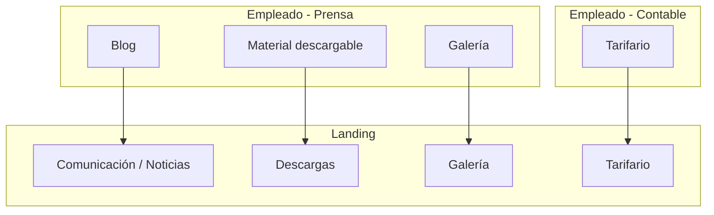

### Diagrama de prioridad de módulos (orden de desarrollo)

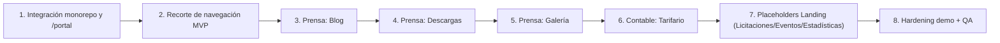

### Diagrama de etapas (bloques) con roles

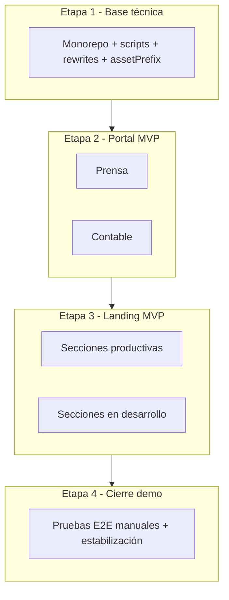

### Tabla de prioridad de módulos (con rol responsable)

| #     | Etapa     | Módulo                            | Rol responsable | Justificación                                         |
| ----- | --------- | --------------------------------- | --------------- | ----------------------------------------------------- |
| **1** | Base      | Proxy `/portal` + helpers de path | Frontend        | Habilita convivencia de apps en una URL.              |
| **2** | Base      | Guard de rutas MVP                | Frontend        | Evita scope creep en demo.                            |
| **3** | Contenido | Blog                              | Prensa          | Activo y visible para demo institucional.             |
| **4** | Contenido | Material descargable              | Prensa          | Módulo de valor público directo.                      |
| **5** | Contenido | Galería                           | Prensa          | Refuerza narrativa visual de landing.                 |
| **6** | Contenido | Tarifario                         | Contable        | Requisito funcional explícito del recorte MVP.        |
| **7** | Landing   | Secciones en desarrollo           | Frontend        | Asegura consistencia del alcance sin ocultar roadmap. |
| **8** | Cierre    | QA funcional demo                 | QA / Frontend   | Reduce riesgo de fallos en presentación.              |

---

## 10. Estimación de tiempos y responsabilidades

Escenarios orientados al cierre y estabilización del MVP vigente.

### Opción A: 2 Frontend + 1 QA

#### MVP (Opción A)

| Rol            | Responsabilidades                                   | Estimación  |
| -------------- | --------------------------------------------------- | ----------- |
| **Frontend 1** | Landing (ajustes, placeholders, navegación pública) | 1-2 semanas |
| **Frontend 2** | Portal MVP (Prensa/Contable, guard y rutas)         | 2-3 semanas |
| **QA**         | Casos de prueba end-to-end de demo                  | 1 semana    |

**Total Opción A: 3-4 semanas**

### Opción B: 1 Frontend fullstack UX

#### MVP (Opción B)

| Rol                    | Responsabilidades                         | Estimación  |
| ---------------------- | ----------------------------------------- | ----------- |
| **Frontend único**     | Landing + Portal + estabilización de demo | 4-6 semanas |
| **Soporte QA parcial** | Verificación manual guiada                | 0.5 semana  |

**Total Opción B: 4-6.5 semanas**

### Resumen comparativo

| Hito                      | Opción A    | Opción B      |
| ------------------------- | ----------- | ------------- |
| **Cierre MVP**            | 3-4 semanas | 4-6.5 semanas |
| **Riesgo operativo**      | Bajo-medio  | Medio         |
| **Capacidad de paralelo** | Alta        | Baja          |

---

## 11. Propuesta de MVP (Minimum Viable Product)

### Alcance del MVP sugerido (landing + portal recortado)

| Incluir en MVP                                                             | No incluir en MVP (siguiente etapa)                           |
| -------------------------------------------------------------------------- | ------------------------------------------------------------- |
| Landing completa navegable                                                 | Habilitación de roles extra del portal                        |
| Placeholder "Seccion en desarrollo" en Licitaciones, Eventos, Estadísticas | Operación funcional de esos 3 módulos                         |
| Portal con dos roles habilitados (Prensa y Contable)                       | Rutas de Proveedor, Cliente, Usuario Básico, ESP, Admin, etc. |
| Prensa: Blog + Descargas + Galería                                         | Flujos integrales de solicitudes/visitas/facturación          |
| Contable: Tarifario                                                        | Gobernanza completa de usuarios/roles productiva              |

### Diagrama MVP

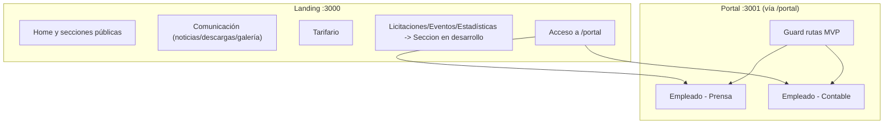

### Resumen MVP en una frase

> **MVP actual**: monorepo con una sola URL pública donde la landing está completa para demo, tres secciones se muestran explícitamente en desarrollo, y el portal queda recortado en runtime a los roles Prensa y Contable bajo `/portal`.

### Criterios de éxito para salida productiva del MVP

1. El MVP está desplegado en **AWS** con infraestructura estable (frontend + backend + networking + SSL).
2. La URL pública oficial `https://puertolaplata.com` responde correctamente y sirve la landing sin errores críticos.
3. La subruta `https://puertolaplata.com/portal` expone el portal correctamente, sin conflictos de rutas ni assets.
4. El frontend está conectado al backend productivo y las funcionalidades clave operan con datos reales.
5. El portal mantiene el recorte MVP de navegación (Prensa y Contable), sin fuga a roles fuera de alcance.
6. Blog, Descargas, Galería y Tarifario funcionan end-to-end (alta/edición/visualización) sobre backend.
7. Licitaciones, Eventos y Estadísticas respetan el estado definido para MVP en ambiente productivo.
8. Monitoreo, logs y alertas mínimas están activos en AWS para detectar caídas y errores críticos.
9. Existe checklist de smoke tests productivos validado post-deploy sobre `puertolaplata.com`.

---

